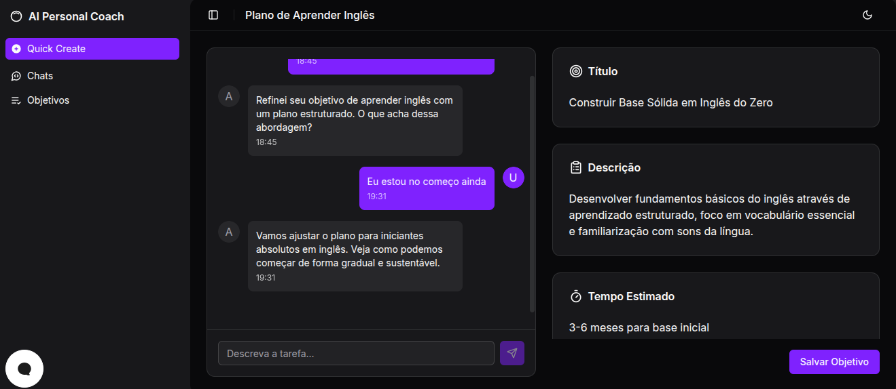
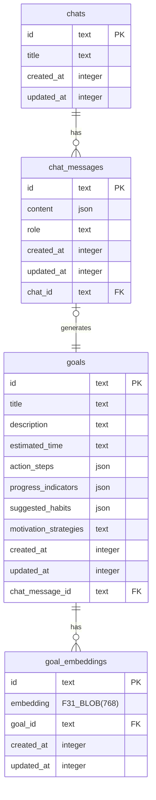

<h1 align="center">
AI Personal Goals Coach
</h1>

<p align="center">
  <a href="#-tecnologias">Tecnologias</a>&nbsp;&nbsp;&nbsp;|&nbsp;&nbsp;&nbsp;
  <a href="#-projeto">Projeto</a>&nbsp;&nbsp;&nbsp;|&nbsp;&nbsp;&nbsp;
  <a href="#-layout">Layout</a>&nbsp;&nbsp;&nbsp;|&nbsp;&nbsp;&nbsp;
  <a href="#memo-licenca">Licença</a>
</p>

<p align="center">
  
  
  
</p>

<p float="center" align="center">
  
</p>

## 🚀 Tecnologias

Este projeto foi desenvolvido com as seguintes tecnologias:

- React Router 7
- TypeScript
- Vite
- Tailwind CSS
- ShadcnUI
- Drizzle ORM
- SQLite
- OpenAI API

## 💻 Projeto

O AI Personal Goals Coach é uma aplicação que transforma objetivos pessoais em planos estruturados com refinamento automático via IA. O objetivo é permitir que usuários descrevam objetivos pessoais de forma simples e contem com um chatbot especializado em coaching para refinar, estruturar e detalhar cada meta, elevando o nível de clareza e organização para o desenvolvimento pessoal.

### ✨ Funcionalidades Principais

- **Refinamento de Objetivos por Coach IA:** Usuários descrevem objetivos pessoais e recebem uma versão refinada, estruturada e pronta para execução
- **Histórico de Conversas:** Todas as interações com o chatbot coach são salvas e podem ser revisitadas
- **Gestão Completa de Objetivos:** Criação, edição, visualização, exclusão e detalhamento de metas pessoais
- **Painel de Análise:** Visualização de métricas e estatísticas dos objetivos e progresso
- **Acompanhamento de Progresso:** Ferramentas para monitorar o avanço em direção aos objetivos
- **Coach Pessoal Virtual:** IA especializada em desenvolvimento pessoal e estabelecimento de metas

## 🔖 Layout

O layout foi desenvolvido com componentes modernos usando ShadcnUI e Tailwind CSS, proporcionando uma interface responsiva e intuitiva para gerenciamento de objetivos pessoais.

## 📁 Estrutura de Pastas

- `app/` - Código principal da aplicação (componentes, features, rotas, serviços)
- `drizzle/` - Schema, seeds e migrações do banco de dados
- `public/` - Arquivos estáticos
- `.github/instructions/` - Documentação interna e PRDs

## 🚀 Como Rodar Localmente

1. **Clone o repositório:**
   ```bash
   git clone <url-do-repo>
   cd ai-personal-goals-coach
   ```
2. **Instale as dependências:**
   ```bash
   npm install
   ```
3. **Configure o banco de dados:**
   - Edite o arquivo `.env` com a variável `DATABASE_URL` (exemplo: `file:./dev.db`)
   - Rode as migrações:
     ```bash
     npx drizzle-kit migrate
     ```
4. **(Opcional) Popule o banco com dados de exemplo:**
   ```bash
   npm run db:seed
   ```
5. **Inicie o servidor de desenvolvimento:**
   ```bash
   npm run dev
   ```
   Acesse em [http://localhost:5173](http://localhost:5173)

## 🐳 Rodando com Docker

```bash
docker build -t ai-personal-goals-coach .
docker run -p 3000:3000 ai-personal-goals-coach
```

## 🛠️ Principais Comandos

- `npm run dev` — Inicia o servidor de desenvolvimento
- `npm run build` — Gera o build de produção
- `npm start` — Sobe o servidor em modo produção
- `npx drizzle-kit studio` — Interface visual para o banco de dados

## ⚙️ Configuração Avançada

### Seleção Automática de Modelos

A aplicação seleciona automaticamente os melhores modelos gratuitos do OpenRouter para cada caso de uso:

- **Chat Service**: Modelo free mais utilizado na última semana para refinar objetivos pessoais com coaching especializado
- **CopilotKit Service**: Modelo free mais utilizado na última semana com suporte a tools para buscas vetoriais e consultas sobre objetivos

#### Como Funciona

1. **Inicialização Singleton**: Na primeira requisição, a aplicação busca a lista de modelos disponíveis do OpenRouter API
2. **Seleção Inteligente**: 
   - Para Chat: Seleciona o modelo gratuito mais popular
   - Para CopilotKit: Seleciona o modelo gratuito mais popular com suporte a tools/functions
3. **Cache**: O modelo selecionado fica em cache (singleton) e não é buscado novamente
4. **Fallback Automático**: Se um modelo ficar indisponível, o sistema automaticamente:
   - Detecta o erro (404, 503, offline)
   - Reseta o cache
   - Busca um novo modelo usando os mesmos critérios
   - Tenta novamente com o novo modelo

#### Comportamento de Fallback

**Exemplo de logs:**
```bash
# Primeira inicialização
Selected best free chat model: deepseek/deepseek-chat-v3-0324:free (DeepSeek Chat)
Selected best free copilot model with tools: anthropic/claude-3-5-haiku:free (Claude 3.5 Haiku)

# Quando modelo fica indisponível
Chat model deepseek/deepseek-chat-v3-0324:free is unavailable, fetching new model...
Resetting chat model cache: deepseek/deepseek-chat-v3-0324:free
Selected best free chat model: google/gemini-flash-1.5:free (Gemini Flash 1.5)
Retrying with new chat model: google/gemini-flash-1.5:free
```

#### Configuração

Apenas configure a API key do OpenRouter no arquivo `.env`:

```bash
OPEN_ROUTER_API_KEY="sua-chave-api"
OPEN_ROUTER_BASE_URL="https://openrouter.ai/api/v1"

# Modelo padrão (usado apenas como fallback em caso de erro na API)
OPEN_ROUTER_MODEL="deepseek/deepseek-chat-v3-0324:free"
```

#### Vantagens

- ✅ **Sempre gratuito**: Usa apenas modelos free do OpenRouter
- ✅ **Sempre atualizado**: Seleciona automaticamente os modelos mais populares
- ✅ **Otimizado**: CopilotKit usa modelo com suporte a tools
- ✅ **Resiliente**: Troca automaticamente quando modelo fica indisponível
- ✅ **Zero configuração**: Funciona automaticamente sem precisar configurar modelos específicos

## 🎯 Exemplos de Uso

**Entrada do usuário:**
"Quero aprender inglês fluente"

**Saída refinada pelo Coach IA:**
- **Título:** "Desenvolver Fluência em Inglês através de Prática Estruturada"
- **Passos de Ação:** Avaliação de nível, rotina diária, curso estruturado...
- **Indicadores de Progresso:** Conversação de 10 min, compreender filme sem legendas...
- **Hábitos Sugeridos:** Estudar 30 min toda manhã, celular em inglês...
- **Estratégias de Motivação:** Marcos mensais, parceiro de estudos, grupos de conversação...

## 📚 Documentação e PRD

- Veja o arquivo `.github/instructions/domain.instructions.md` para detalhes do produto, objetivos, estrutura de dados e exemplos de uso do sistema de refinamento de objetivos pessoais.

### Diagrama ERD do Banco de Dados

O diagrama abaixo representa as principais tabelas e relacionamentos do banco de dados, conforme definido em `drizzle/schema.ts`.




## :memo: Licença

Veja o arquivo [LICENSE](LICENSE) para mais detalhes.

### Autor

---

<p align="center">
  <a href="https://github.com/cleysonsilvame/" title="Cleyson Silva">
    
    <br />
    <sub><b>Cleyson Silva</b></sub> 🚀
  </a>
  <br />
  <a href="https://www.linkedin.com/in/cleyson-silva-639b01188/">
    
  </a>
  <a href="mailto:cleysonsilva.me@gmail.com">
    
  </a>
</p>

---

# A fazer (TODO:)

- [ ] Verificar a melhor forma de fazer a validação de dados sem ficar fazer o mapper toda hora. Não sei se é melhor ficar dentro do domain ou infra. No caso usando zod.
- [ ] Melhorar a estrutura de pastas para representar o que é domain, infra e core.
- [ ] Adicionar testes?
